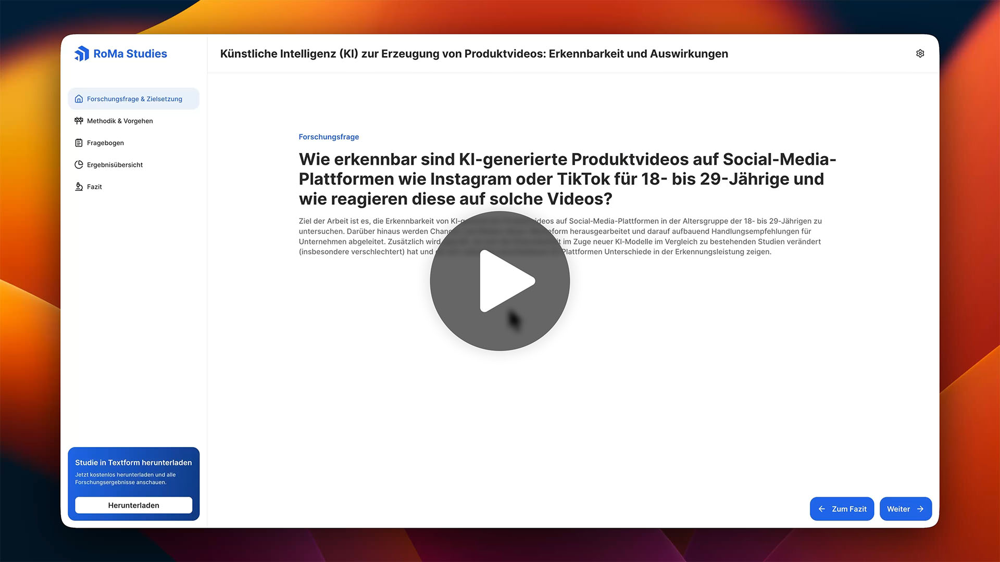

<div align="center">


# RoMa Studies

**An interactive scientific paper, built with React**

RoMa Studies was built to present scientific content as an interactive multimedia
system rather than a static paper. It turns the findings of a real study on
AI-generated product videos into something you can explore: walk through the study,
take its original questionnaire yourself, compare your guesses with how real
participants answered, and dig into the results chart by chart.

<br />

[](https://react.dev)
[](https://vite.dev)
[](https://reactrouter.com)
[](#faq)
[](#license)

[](https://youtu.be/HZ8f9YgrsVI)

[Features](#features) · [Quick start](#quick-start) · [The study](#the-study) · [Tech stack](#tech-stack) · [FAQ](#faq)

</div>

---

## Demo

A short walkthrough of the interactive study, the play-along questionnaire, and the
results overview.

<p align="center">
  <a href="https://youtu.be/HZ8f9YgrsVI">
    
  </a>
</p>

---

## Features

- **Research question first.** The study's question and objective set the stage
  before any data.
- **Animated method timeline.** The research process is rendered as an interactive,
  step-by-step flow chart driven by `timeline.json`.
- **Play-along questionnaire.** A faithful rebuild of the original survey: watch each
  of the 16 product videos, decide *real* or *AI-generated*, then reveal how your
  guess compares with the actual study results.
- **Progress that sticks.** Answered questions and watched videos are remembered in
  the browser's local storage, with live status in the sidebar and a one-click reset.
- **Results you can explore.** An interactive overview visualizing demographics,
  per-video recognition rates, accuracy and balanced accuracy, a confusion matrix,
  sensitivity and specificity, a Digen vs. Tasy comparison, and disturbance, image,
  and purchase-impact scales.
- **Data-driven.** All study content is read from JSON files and rendered
  dynamically; nothing is hard-coded into the components.
- **Download the full study.** The complete paper (PDF) is available straight from
  the sidebar.
- **Responsive, app-like UI.** Collapsible sidebar, route-based modals (About,
  Privacy, Imprint), and scroll-to-top on navigation.

---

## Quick start

You need **Node.js 20 or newer** (LTS recommended): <https://nodejs.org>.

```bash
npm install      # install dependencies (requires internet)
npm run dev      # start the dev server at http://localhost:5173
npm run build    # production bundle in dist/
```

The dev server prints the address in the terminal. Stop it with **Ctrl + C**
(Windows) or **Cmd + C** (macOS).

---

## The study

The application visualizes a study on the recognizability and effects of
AI-generated product videos among 18 to 29 year olds on social media. Participants
watched 16 product videos, 8 real and 8 AI-generated (produced with Digen and
Tasy.ai), and classified each as real or AI-generated, then answered attitude
questions about how such content affects their perception and purchasing decisions.

The interactive version lets you do the same: take the questionnaire, commit to your
own answers, and then see how the real participants responded across every metric on
the results page.

---

## Tech stack

- **React 19**, built with **Vite 7**
- **React Router 7** (BrowserRouter, with route-based modals)
- Plain **CSS** (CSS Modules and CSS variables), no UI framework
- **ESLint 9** (flat config) with the React Hooks and React Refresh plugins
- Browser **local storage** for saving questionnaire progress

The charts and diagrams are hand-built with plain DOM, CSS, and SVG; there is no
charting or component library. The only runtime dependencies are `react`,
`react-dom`, and `react-router-dom`.

---

## FAQ

### Where are my answers stored?

In the browser's local storage, on that device and in that browser. You can pause and
continue on your next visit. A reset button clears your progress, and opening the app
in a different browser starts from an empty state.

### Do I need an internet connection?

Only `npm install` needs internet. After that the app runs entirely client-side;
there is no account, no server, and no cloud.

### What if port 5173 is taken?

Vite automatically picks the next free port (for example 5174); the exact address is
shown in the terminal output.

### Where can I read the full study?

Download the complete paper (PDF) from the sidebar inside the app, or from
`public/docs/`.

---

## Credits

Built by **Robert Stein** and **[Marcel Otto](https://marcel-otto.de)**, students of
*Digitale Medien* at **Hochschule Fulda**, for the **Multimediasysteme** module in 21 days.
Designed as a Figma prototype, then implemented as a React single-page application.

The AI product videos were created with **[Digen](https://digen.ai)** and **[Tasy.ai](https://tasy.ai)**; thanks to **Julius
Kopp** (founder of Tasy.ai) for providing the tool free of charge for the research.

## License

Copyright © Marcel Otto 2026. This project is proprietary: all rights reserved. No
license is granted for use, copying, modification, or distribution.
